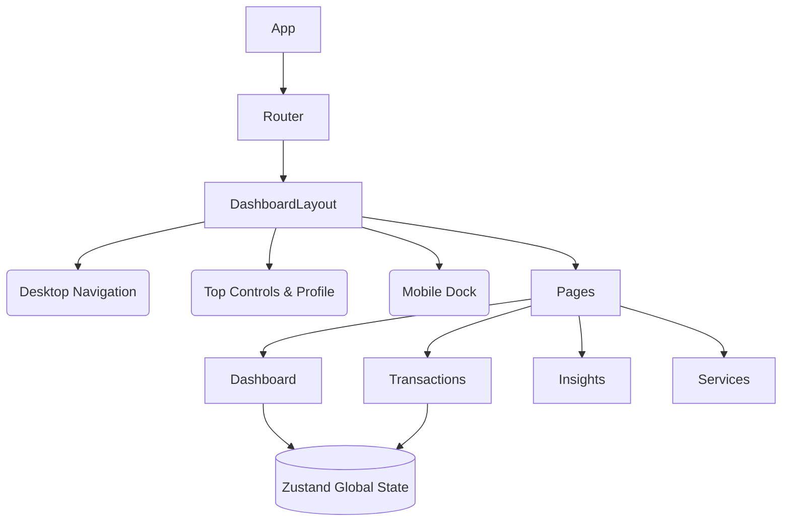

<p align="center">
  
</p>

# ZorvynFi Finance Dashboard 

> An ultra-premium, highly responsive financial command center engineered for top-tier banking analytics, seamlessly blending data-rich insights with state-of-the-art mobile viewport capabilities.

---

## 📖 Overview

ZorvynFi is a modern financial dashboard application designed to completely reinvent personal transaction management. Inspired by the sleekest banking applications, it features responsive mobile adaptations, dynamic real-time charting, and a persistent architectural layout that scales perfectly across desktops, tablets, and smartphones.

### 🔗 Live Links
- **Live Demo**: https://zorvyn-fi.vercel.app/
- **Repository**: [https://github.com/XSTRANGER-7/zorvyn-fi](https://github.com/XSTRANGER-7/zorvyn-fi)

---

## 📸 Sneak Peek

*(Add your actual repository image/video links here!)*
<!-- 
<div align="center">
  
  
</div> 
-->

---

## ⚡ Features

- **Premium Interface Design**: Glossy "glassmorphism" components coupled with advanced CSS layout engineering (e.g., dynamic racing stripes & precise component boundaries).
- **Mobile-First UX Architecture**: Implements true `100dvh` tracking, native iOS hardware-accelerated momentum scrolling, and programmatic `safe-area-insets` mapping to float cleanly above home screen indicators.
- **Dynamic Charting Capabilities**: Deep integration with `recharts` calculates real-time transaction mappings instantly, utilizing dynamic date logic to restrict ghost data projection perfectly against the current system timeline.
- **Mock Data Layer Injection**: Boots with 15+ rich transaction objects initialized out-of-the-box (spanning 2026 data arrays).
- **Dark Mode Support**: Deep-integrated aesthetic `ThemeToggle` capability controlling centralized Tailwind palette variables.

---

## 🛠️ Tech Stack

- **Core**: React 18 / TypeScript
- **Bundler**: Vite
- **Styling Engine**: Tailwind CSS v4 (with customized `@layer` rules and layout variables)
- **State Management**: Zustand
- **Routing**: React Router DOM (v6)
- **Data Visualization**: Recharts
- **Icons & Assets**: Lucide React
- **Dates Engine**: Date-fns

---

## 🏗️ Project Structure & Architecture

ZorvynFi is built upon a strict **Module-Based Component Architecture**, keeping routing, utility functions, global state, and presentation layers highly decoupled.

```text
src/
├── api/                   # Integration stubs and mock network services
├── app/                   # Root routing (App.tsx, routes.tsx)
├── components/
│   ├── charts/            # Recharts implementations (BalanceChart, IncomeExpenseChart)
│   ├── layout/            # Universal layouts (DashboardLayout, MobileNav, Sidebar)
│   ├── modals/            # Overlay interceptors (AddTransactionModal)
│   ├── table/             # Transaction lists
│   └── ui/                # Base low-level primitives (Button, Card)
├── data/                  # Seeding configurations (mockData.ts)
├── pages/                 # Full view components (Dashboard, Insights, Services, etc.)
├── store/                 # Zustand global persistence stores
└── utils/                 # Extracted helpers and math logic
```

### 🧠 Architectural Diagram



---

## 🔐 RBAC Implementation (Role-Based Access Control)

ZorvynFi manages advanced security abstractions completely on the Client-side using `useAuthStore` (Zustand).

- **Global Availability**: By dropping `.setRole()` interceptors natively into the Top Navbar Profile Dropdown (and Desktop Sidebar), users can hot-swap environments.
- **Admin Tier**: Receives full Write privileges. Displays floating "+" Add Transaction controls and unlocks Modal workflows.
- **Viewer Tier**: Placed in strict Read-Only mode. Layout gracefully shrinks out protected modifying DOM nodes.

---

## 💾 Data Handling

ZorvynFi achieves complete mock persistence without a live backend utilizing Zustand's internal **Persist Middleware** (`localStorage`). 

1. **Version Control Validation**: The data layer is currently locked against `transactions-storage-v3`.
2. Upon mounting, the application evaluates the browser's persistent cache.
3. If new, it injects the rich history file natively tracked in `mockData.ts`.
4. From that point on, if an Admin adds manual transactions inside the application, it securely rewrites the layout cache—guaranteeing data is retained successfully across hard page refreshes!

---

## 🚀 Setup Instructions

1. **Clone the repository:**
   ```bash
   git clone https://github.com/XSTRANGER-7/zorvyn-fi.git
   ```

2. **Navigate into the directory:**
   ```bash
   cd zorvyn-fi
   ```

3. **Install Dependencies:**
   ```bash
   npm install
   ```

4. **Launch the Development Server:**
   ```bash
   npm run dev
   ```

5. Access the application on `http://localhost:5173`.

---

<p align="center">
  <b>Made with ❤️ by Sarthak Gupta</b>
</p>
